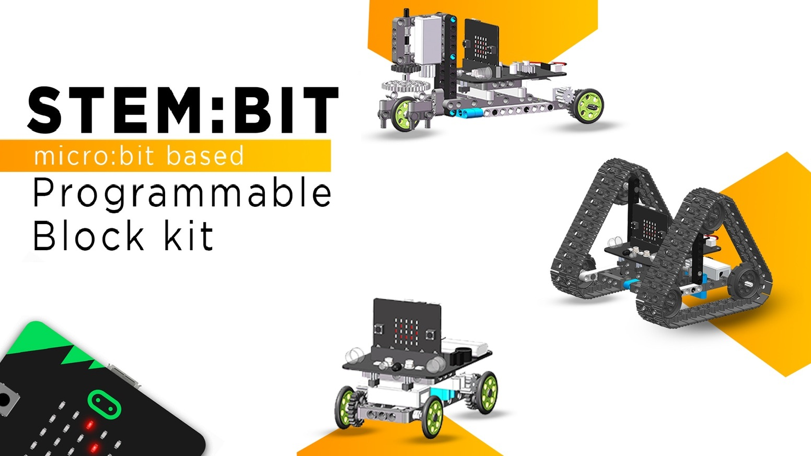
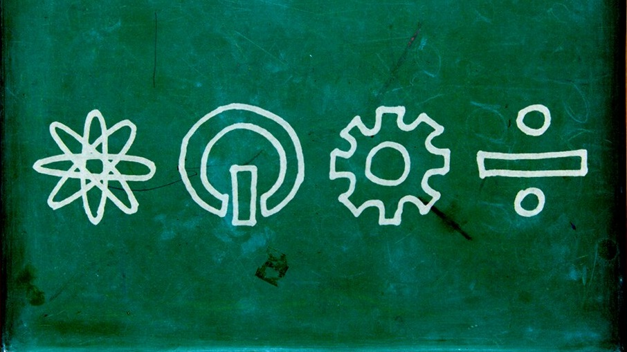
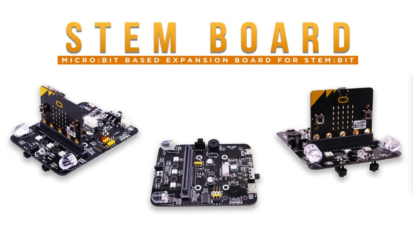

# Stem:Bit - The programmable block kit for micro:bit

This is makecode extension for Stem Bit by SB Components.

To add extension to makecode, click ***Advanced > Extensions***

Enter github link https://github.com/sbcshop/pxt-stembit.git in the box and search. Tap on the StemBit box. 
 
Follow Stem:Bit instruction manual for using blocks and making different shapes with blocks.

### Features

- Easy to assemble.
- Easy to code.
- Improves imagination power.
- Nurture creativity.
- Learn the basics of electronics.

STEM stands for Science Technology Engineering Mathematics and bit is small
 quantity.
 
 
 
 
 
The Stem:bit is made by keeping in mind the importance of STEM subjects for students. Stem:Bit is collection of building blocks which can be reshaped in different shapes. Stem:Bit is about exploring creativity in students. Most important feature of Stem:Bit is that it can be programmed with easy drag and drop boxes called as block programming. 

 
This extension is meant to program Stem:Bit, however its blocks can be used for interfacing sensors and motors separately.
  

This kit is a combination of the electronic components with building block, and users can control them with micro:bit programming, such as infrared remote control, obstacle  avoidance, tracking, colorful lights and other functions. The building blocks are also compatible with LEGO, that if you are interested in building blocks and want to learn programming, this building block will be a good choice. 

